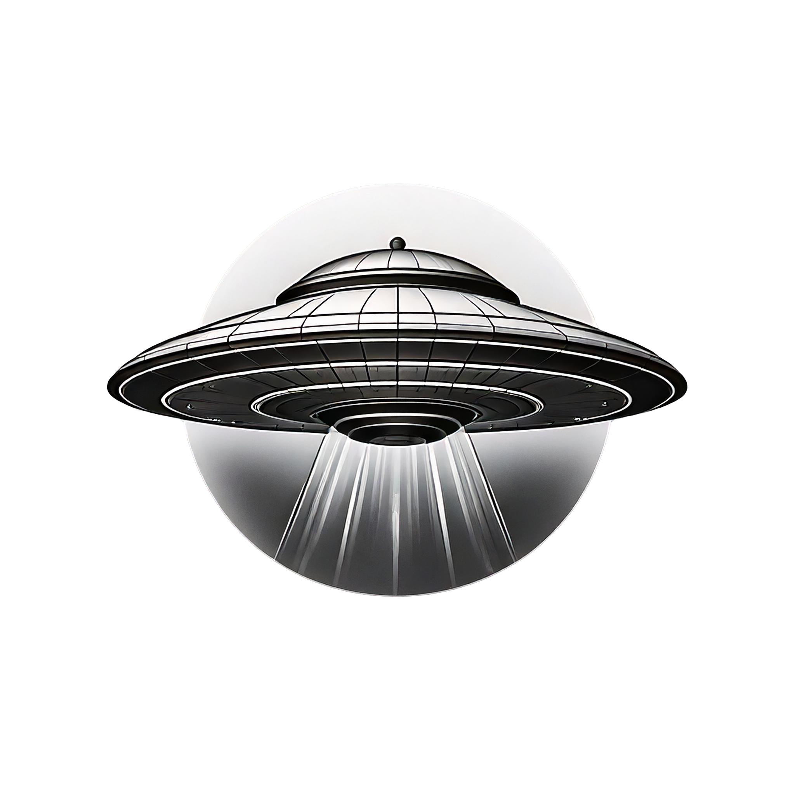

<a id="readme-top"></a>

<!-- PROJECT LOGO -->
<br />
<div align="center">
  <a href="https://github.com/othneildrew/Best-README-Template">
    
  </a>

  <h1 align="center">The RT Files</h1>

  <p align="center">
    An out of this world movie experience!
    <br />
    <a href="https://github.com/SmilodonP/movie-junk-n-stuff"><strong>Explore the docs »</strong></a>
    <br />
    <br />
    
  </p>
</div>


<!-- TABLE OF CONTENTS -->
<details>
  <summary>Table of Contents</summary>
  <ol>
    <li>
      <a href="#about-the-project">About The Project</a>
      <ul>
        <li><a href="#built-with">Built With</a></li>
      </ul>
    </li>
    <li>
      <a href="#getting-started">Getting Started</a>
      <ul>
        <li><a href="#prerequisites">Prerequisites</a></li>
        <li><a href="#installation">Installation</a></li>
      </ul>
    </li>
    <li><a href="#usage">Usage</a></li>
    <li><a href="#challenges">Challenges</a></li>
    <li><a href="#wins">Wins</a></li>
    <li><a href="#contributors">Contributors</a></li>
  </ol>
</details>


<!-- ABOUT THE PROJECT -->
## About The Project

[![Product Name Screen Shot][product-screenshot]](https://example.com)

Looking for the next great movie, but unsure of what to look for, then this is a great place to stop. It provides a clean user experience that shows popular movies from a wide range of genres. Each movie is actively voted on to show its relative popularity.


<p align="right">(<a href="#readme-top">back to top</a>)</p>


### Built With

[![React][React.js]][React-url]

<p align="right">(<a href="#readme-top">back to top</a>)</p>


## Getting Started

### Prerequisites


* npm
  ```sh
  npm install npm@latest -g
  ```

### Installation

1.  Fork this repo
2.  Clone **and rename** this repo: 
```
git clone git@github.com:SmilodonP/movie-junk-n-stuff.git [new-name]
```  
   For example: 
```
git clone git@github.com:SmilodonP/movie-junk-n-stuff.git the-rt-files
```
3.  `cd` into the directory
4.  Install necessary dependencies with `npm install`
5.  Run your React app with `npm start`
6.  Go to `http://localhost:3000/` and you should see a page with some starter elements
7.  Enter `control + c` in your terminal to stop running the React app at any time
8. To run Cypress tests, use `npx cypress open`
<p align="right">(<a href="#readme-top">back to top</a>)</p>


<!-- USAGE EXAMPLES -->
## Usage

Use this space to show useful examples of how a project can be used. Additional screenshots, code examples and demos work well in this space. You may also link to more resources.

_For more examples, please refer to the [Documentation](https://example.com)_

<p align="right">(<a href="#readme-top">back to top</a>)</p>

## Challenges

_One of the challenges that we encoutered during the development process was incorporating new technologies that were unfamilair to us within the frameworks of knowledge that we contained. For example, we were using a technology that was new to us called Cypress which helped to easily test the end to end aspects of a web page. We knew what we wanted to test, but being unfamiliar with the tech made it more challenging to get to the elements that we wanted to see._

_Another challenge that we faced in this project was figuring out how to organize the data within our app to account for inheritence in JS/React projects. This was especially evident when working through the CSS styling. With hard work and perserverance we were able to get things (at least mostly) properly laid out to match our design goals._

## Wins

_A win was being able to progress through the project with mostly async work. The extra communication that is required to make sure that process works and works well while allowing the project to continue was an additional step of difficulty that we handled well._

_Another win was being able to surpass the styling and design requirements of the project by including heaps of reactive design in our UI/UX CSS._

### Contributors:

<a href="https://github.com/SmilodonP">Karl Fallenius</a>
<br>
<a href="https://github.com/Sgalvin36">Shane Galvin</a>

Project Link: [https://github.com/SmilodonP/movie-junk-n-stuff.git](https://github.com/SmilodonP/movie-junk-n-stuff.git)

Deployed Project Link: [https://thertfiles.vercel.app/]

<p align="right">(<a href="#readme-top">back to top</a>)</p>

[React.js]: https://img.shields.io/badge/React-20232A?style=for-the-badge&logo=react&logoColor=61DAFB
[React-url]: https://reactjs.org/
